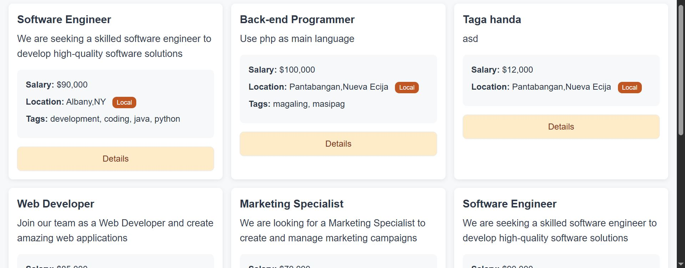
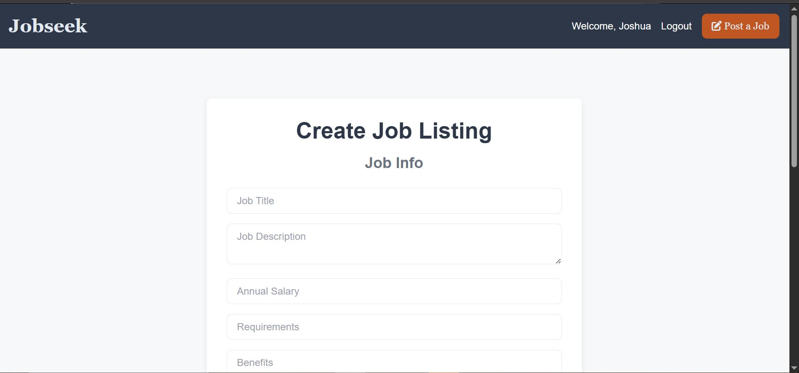
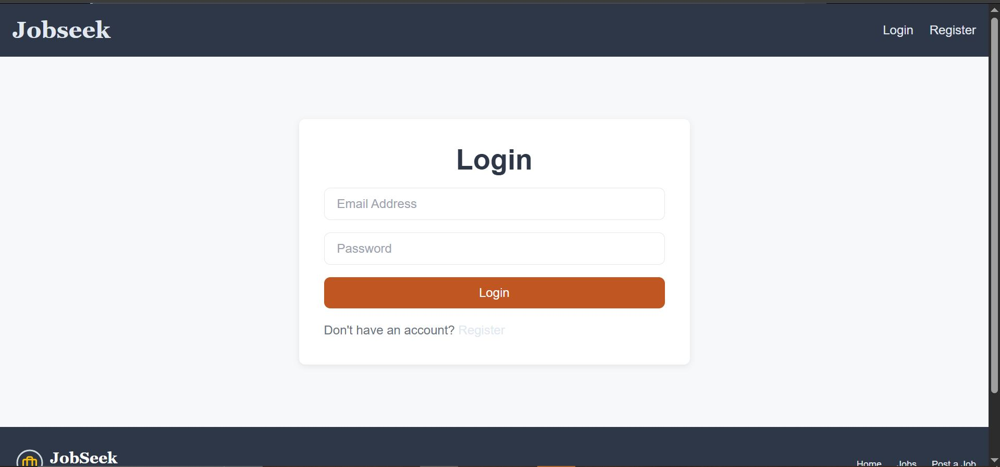

# JobSeeker

A job listing web application built with a custom PHP MVC framework. Users can browse, post, edit, and delete job listings, with full authentication and authorization support.

---

## Screenshots

| Home Page | Listings |
|-----------|----------|
|  |  |

| Post a Job | Login |
|------------|-------|
|  |  |

---

## Features

- Browse all job listings with search by keyword and location
- Create, edit, and delete job listings (authenticated users only)
- User registration and login with session-based authentication
- Authorization — only the owner of a listing can edit or delete it
- Input validation and sanitization on all forms
- Flash messages for success and error feedback
- Custom PHP MVC framework (no Laravel/Symfony dependency)

---

## Tech Stack

- **Backend:** PHP 8+, PDO (MySQL)
- **Frontend:** HTML, CSS (custom + utility stylesheet)
- **Database:** MySQL
- **Architecture:** Custom MVC — Router, Controllers, Views, Middleware
- **Autoloading:** Composer (PSR-4)
- **Web Server:** Apache (with `.htaccess` URL rewriting)

---

## Project Structure

```
ws03/
├── App/
│   ├── controllers/
│   │   ├── HomeController.php       # Homepage with latest listings
│   │   ├── ListingController.php    # CRUD for job listings + search
│   │   ├── UserController.php       # Register, login, logout
│   │   └── ErrorController.php      # 404 and error pages
│   └── views/
│       ├── home.view.php
│       ├── listings/                # index, show, create, edit views
│       ├── users/                   # login, register views
│       └── partials/                # navbar, footer, head, banners, etc.
├── Framework/
│   ├── Router.php                   # Custom HTTP router with param support
│   ├── Database.php                 # PDO wrapper
│   ├── Session.php                  # Session & flash message management
│   ├── Validation.php               # Input validation helpers
│   ├── Authorization.php            # Ownership checks
│   └── middleware/
│       └── Authorize.php            # Auth/guest route guards
├── config/
│   └── db.php                       # Database connection config
├── public/
│   ├── index.php                    # Application entry point
│   ├── .htaccess                    # Apache URL rewriting
│   ├── css/
│   └── images/
├── routes.php                       # All application routes
├── helpers.php                      # Global helper functions
└── composer.json
```

---

## Getting Started

### Prerequisites

- PHP 8.0 or higher
- MySQL 5.7+ or MariaDB
- Apache with `mod_rewrite` enabled
- Composer

### Installation

1. **Clone the repository**
   ```bash
   git clone https://github.com/your-username/jobseeker.git
   cd jobseeker
   ```

2. **Install dependencies**
   ```bash
   composer install
   ```

3. **Set up the database**

   Create a MySQL database named `jobseeker`, then run the following SQL to create the required tables:

   ```sql
   CREATE TABLE users (
       id INT AUTO_INCREMENT PRIMARY KEY,
       name VARCHAR(100) NOT NULL,
       email VARCHAR(100) NOT NULL UNIQUE,
       password VARCHAR(255) NOT NULL,
       city VARCHAR(100),
       state VARCHAR(100),
       created_at TIMESTAMP DEFAULT CURRENT_TIMESTAMP
   );

   CREATE TABLE listings (
       id INT AUTO_INCREMENT PRIMARY KEY,
       user_id INT NOT NULL,
       title VARCHAR(255) NOT NULL,
       description TEXT NOT NULL,
       salary DECIMAL(10, 2),
       tags VARCHAR(255),
       company VARCHAR(255),
       address VARCHAR(255),
       city VARCHAR(100) NOT NULL,
       state VARCHAR(100) NOT NULL,
       phone VARCHAR(50),
       email VARCHAR(100) NOT NULL,
       requirements TEXT,
       benefits TEXT,
       created_at TIMESTAMP DEFAULT CURRENT_TIMESTAMP,
       FOREIGN KEY (user_id) REFERENCES users(id) ON DELETE CASCADE
   );
   ```

4. **Configure the database connection**

   Edit `config/db.php` and update the credentials:
   ```php
   return [
       'host'     => 'localhost',
       'port'     => 3306,
       'dbname'   => 'jobseeker',
       'username' => 'your_db_user',
       'password' => 'your_db_password',
       'charset'  => 'utf8mb4'
   ];
   ```

5. **Configure Apache**

   Point your virtual host document root to the `public/` directory. The included `.htaccess` handles URL rewriting to `index.php`.

   Example virtual host:
   ```apache
   <VirtualHost *:80>
       DocumentRoot /path/to/jobseeker/public
       <Directory /path/to/jobseeker/public>
           AllowOverride All
       </Directory>
   </VirtualHost>
   ```

6. **Visit the app** at `http://localhost` (or your configured domain).

---

## Routes

| Method | URI | Description | Auth Required |
|--------|-----|-------------|:---:|
| GET | `/` | Homepage with latest listings | No |
| GET | `/listings` | All job listings | No |
| GET | `/listings/search` | Search by keyword/location | No |
| GET | `/listings/{id}` | View a single listing | No |
| GET | `/listings/create` | Create listing form | ✅ |
| POST | `/listings` | Store new listing | ✅ |
| GET | `/listings/{id}/edit` | Edit listing form | ✅ |
| PUT | `/listings/{id}` | Update a listing | ✅ |
| DELETE | `/listings/{id}` | Delete a listing | ✅ |
| GET | `/auth/register` | Register form | Guest only |
| POST | `/auth/register` | Register new user | Guest only |
| GET | `/auth/login` | Login form | Guest only |
| POST | `/auth/login` | Authenticate user | Guest only |
| POST | `/auth/logout` | Logout | ✅ |

---

## Author

**Joshua Enrico Capuyon** — [joshuaenricocapuyon@gmail.com](mailto:joshuaenricocapuyon@gmail.com)

---

## License

This project is for educational purposes.
